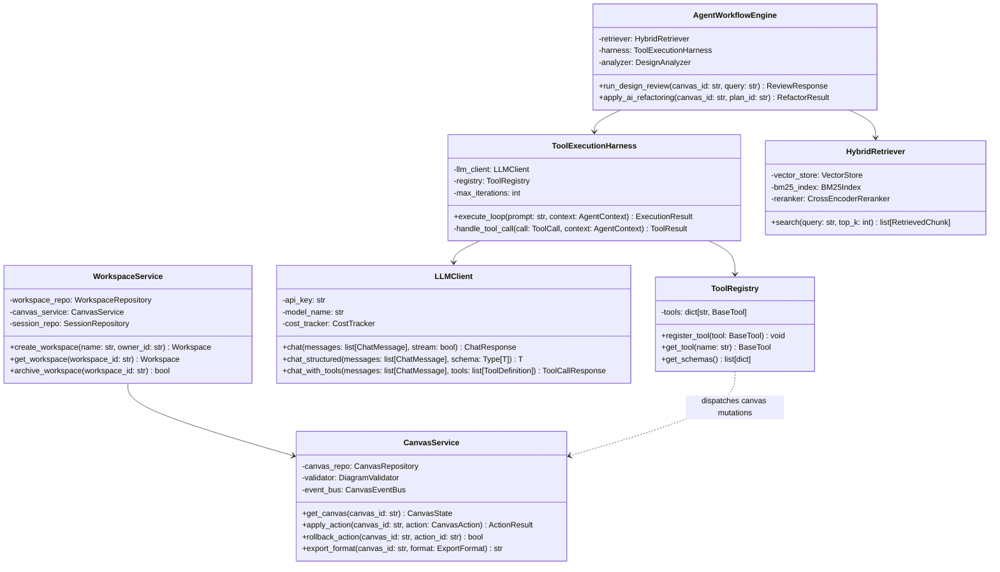
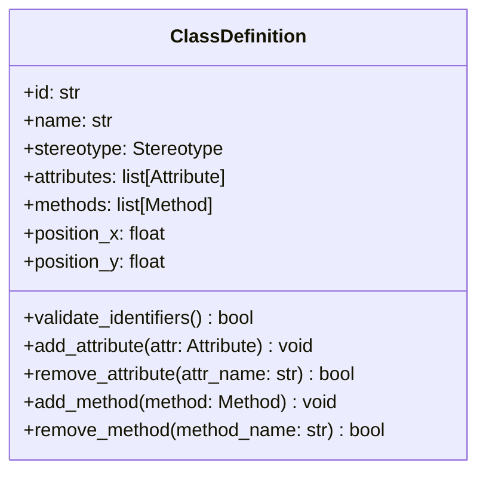
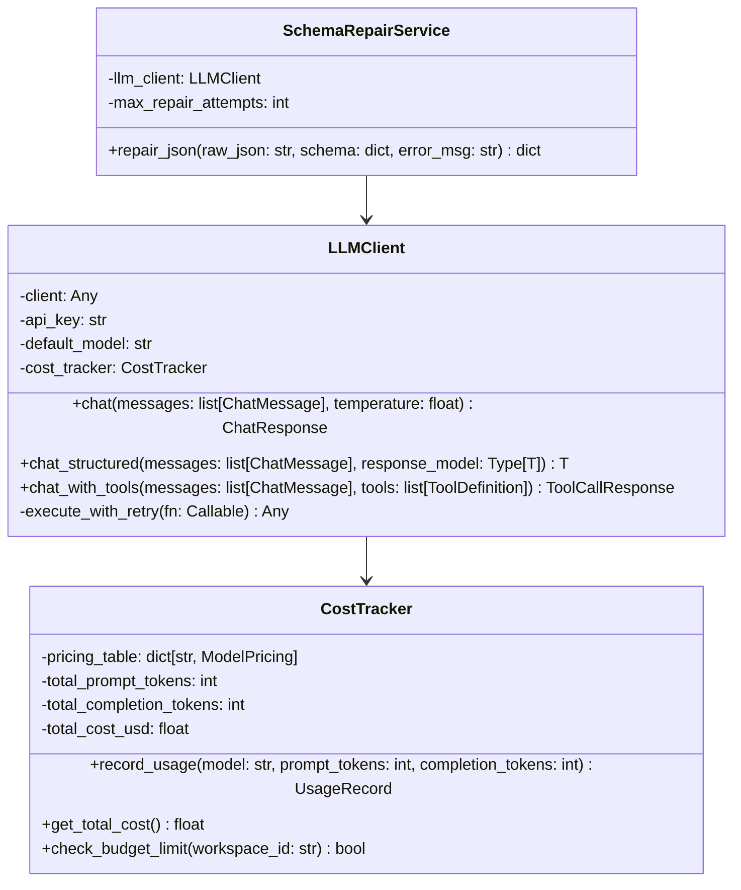
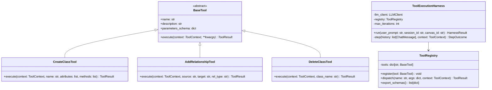
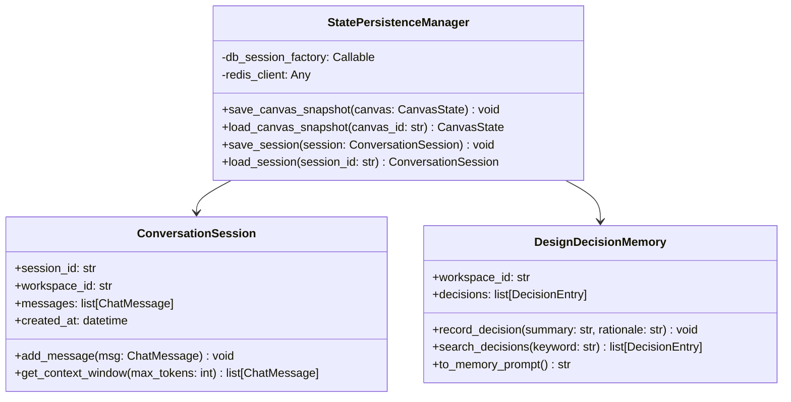
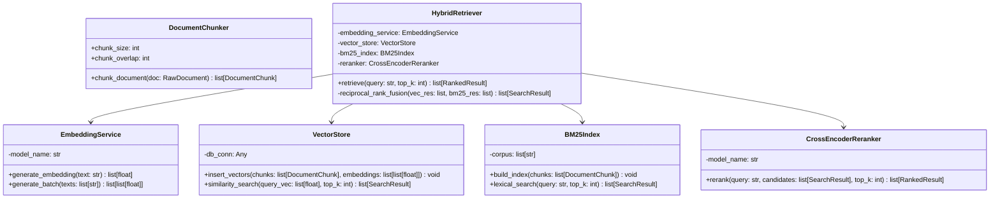
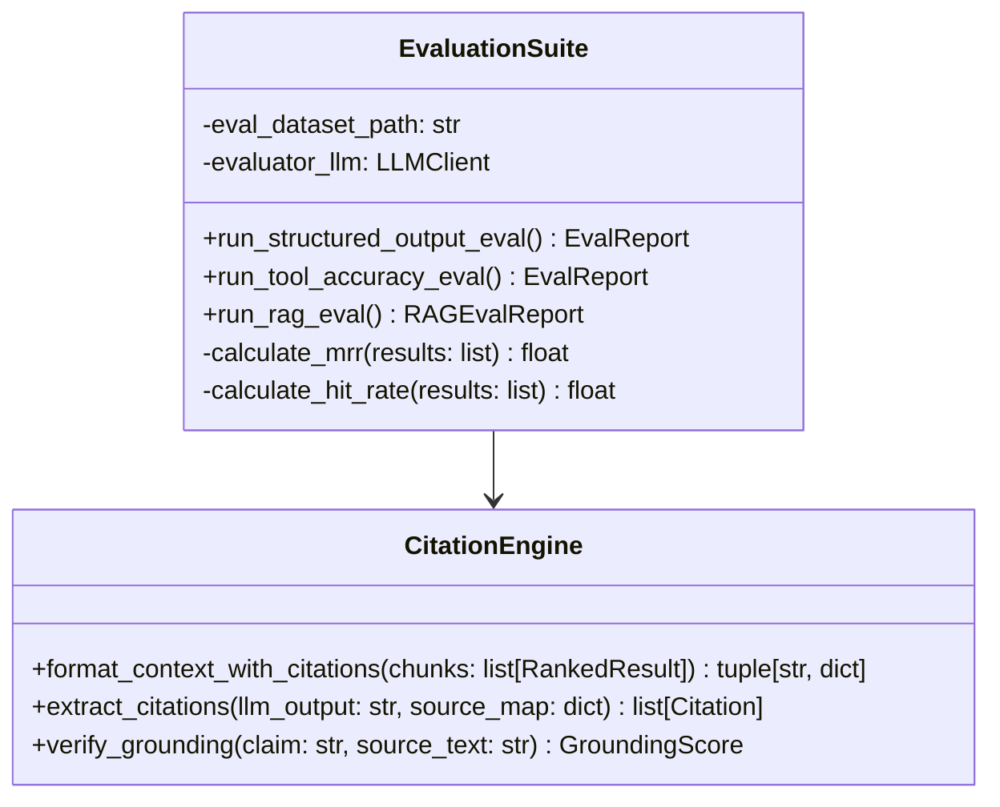
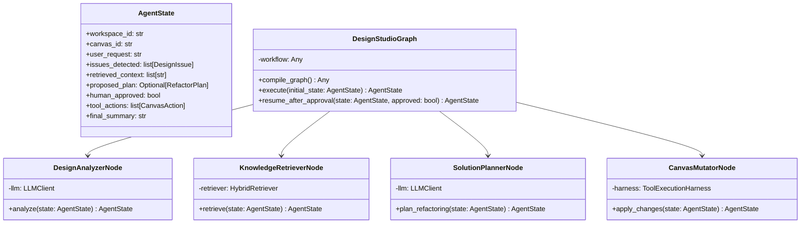
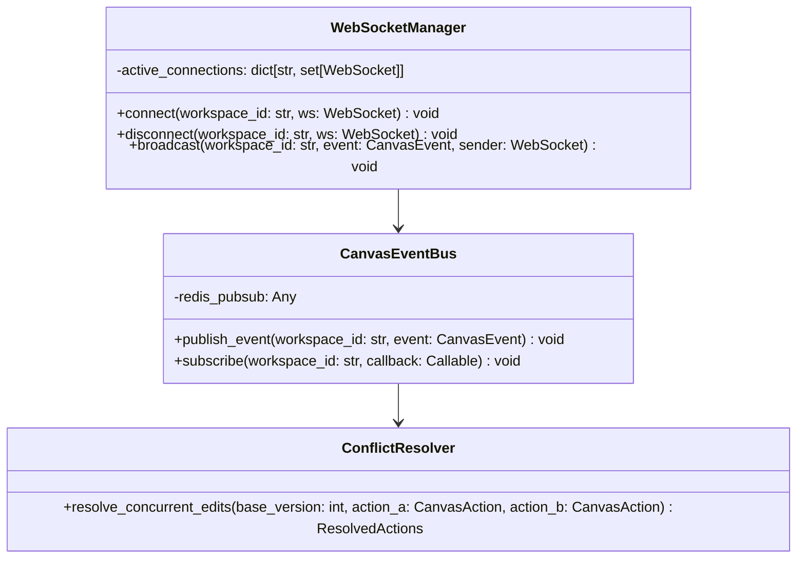

# AI Design Studio — Low-Level Architecture & Implementation Plan (`plan.md`)

## 1. Overview & System Design Philosophy

The **AI Design Studio** is an interactive, collaborative software-design workspace where humans and AI co-create and review architectural and low-level designs (Class Diagrams, ERDs, Sequence Diagrams, Component Diagrams).

Following the progressive learning roadmap in [AI_Design_Studio_Learning_Roadmap.md](file:///c:/Users/bhuwa/study/AI-design-studio/AI_Design_Studio_Learning_Roadmap.md), the system strictly separates:
1. **Core Domain & Canvas State**: Canonical, deterministic source of truth for the diagram.
2. **AI & LLM Services**: Non-deterministic reasoning layer producing structured actions/tools.
3. **Execution & Validation Safety Rails**: Validates all LLM tool requests against domain rules before state mutations.
4. **Knowledge Retrieval (RAG)**: Hybrid lexical + semantic retrieval engine for grounding software design principles.
5. **Real-time Sync & Collaboration**: Event-driven WebSocket synchronization engine.

---

## 2. High-Level Class & Component Architecture



---

## 3. Detailed Low-Level Class Specifications

---

### Module 1: Core Domain Models (Diagram Representation)

#### 3.1 `ClassDefinition`
Represents an individual UML Class or Interface entity on the canvas.



- **Attributes**:
  - `id: str`: Unique UUID identifying this class node on the canvas.
  - `name: str`: Identifier name of the class (e.g., `OrderService`, `User`).
  - `stereotype: Stereotype`: Enum (`ENTITY`, `VALUE_OBJECT`, `SERVICE`, `INTERFACE`, `ABSTRACT`).
  - `attributes: list[Attribute]`: List of fields/properties belonging to this class.
  - `methods: list[Method]`: List of methods/behaviors declared on this class.
  - `position_x: float`: Horizontal coordinate on the 2D infinite canvas.
  - `position_y: float`: Vertical coordinate on the 2D infinite canvas.

- **Methods**:
  - `validate_identifiers() -> bool`:
    - *What it is*: Validates that the class name, attribute names, and method signatures conform to standard identifier rules and contains no duplicates within this class.
    - *Why it is there*: LLMs frequently hallucinate duplicate fields or syntax errors (e.g., spaces in variable names); this domain constraint guarantees canvas integrity.
  - `add_attribute(attr: Attribute) -> void`:
    - *What it is*: Appends an `Attribute` object to `self.attributes` after checking for uniqueness by name.
    - *Why it is there*: Encapsulates the mutation of attributes rather than exposing raw list access.
  - `remove_attribute(attr_name: str) -> bool`:
    - *What it is*: Searches and deletes an attribute by name; returns `True` if found, `False` otherwise.
    - *Why it is there*: Safe targeted deletion without index-based mutations.
  - `add_method(method: Method) -> void`:
    - *What it is*: Appends a `Method` object after checking signature uniqueness (overload validation).
    - *Why it is there*: Ensures method definitions do not clash with existing signatures.
  - `remove_method(method_name: str) -> bool`:
    - *What it is*: Removes method definitions matching the target name.
    - *Why it is there*: Provides clean programmatic API for tool-calling actions.

---

#### 3.2 `Attribute` & `Method`
Primitive building blocks of class internals.

- **`Attribute` Attributes**:
  - `name: str`: Field name (e.g., `email`).
  - `data_type: str`: Data type string (e.g., `str`, `UUID`, `list[OrderItem]`).
  - `visibility: Visibility`: Enum (`PUBLIC`, `PRIVATE`, `PROTECTED`, `PACKAGE`).
  - `is_static: bool`: Indicates static/class-level field.
  - `default_value: Optional[str]`: Default initialization value if present.

- **`Attribute` Methods**:
  - `to_uml_string() -> str`:
    - *What it is*: Returns standard UML format like `- email: str = None`.
    - *Why it is there*: Used by the prompt serialization engine to serialize diagrams into text readable by LLMs and exportable to PlantUML/Mermaid.

- **`Method` Attributes**:
  - `name: str`: Method name (e.g., `authenticate`).
  - `parameters: list[Parameter]`: List of parameter definitions (`name`, `type`, `default`).
  - `return_type: str`: Return type specification (e.g., `bool`, `UserToken`).
  - `visibility: Visibility`: Enum (`PUBLIC`, `PRIVATE`, `PROTECTED`).
  - `is_abstract: bool`: Indicates abstract method.
  - `is_static: bool`: Indicates static method.

- **`Method` Methods**:
  - `to_signature_string() -> str`:
    - *What it is*: Returns UML-compliant signature like `+ authenticate(credentials: AuthInput): bool`.
    - *Why it is there*: Needed for duplicate checking, diagram rendering, and LLM context injection.

---

#### 3.3 `Relationship`
Defines connections between entities.

- **Attributes**:
  - `id: str`: Unique relation ID.
  - `source_class_id: str`: Foreign key to source `ClassDefinition.id`.
  - `target_class_id: str`: Foreign key to target `ClassDefinition.id`.
  - `relation_type: RelationType`: Enum (`ASSOCIATION`, `AGGREGATION`, `COMPOSITION`, `INHERITANCE`, `IMPLEMENTATION`, `DEPENDENCY`).
  - `source_multiplicity: Optional[str]`: Multiplicity at source end (e.g., `1`, `0..1`).
  - `target_multiplicity: Optional[str]`: Multiplicity at target end (e.g., `0..*`, `1..*`).
  - `label: Optional[str]`: Relationship verb/description (e.g., `"creates"`, `"manages"`).

- **Methods**:
  - `is_hierarchical() -> bool`:
    - *What it is*: Checks if relation is `INHERITANCE` or `IMPLEMENTATION`.
    - *Why it is there*: Used by circular-dependency check routines to ensure DAG (directed acyclic graph) properties in inheritance trees.
  - `validate_endpoints(existing_class_ids: set[str]) -> bool`:
    - *What it is*: Validates that both `source_class_id` and `target_class_id` exist.
    - *Why it is there*: Prevents dangling relationship pointers when a class is deleted.

---

#### 3.4 `CanvasState` (Aggregate Root)
The single source of truth for an entire canvas document.

- **Attributes**:
  - `workspace_id: str`: Workspace grouping identifier.
  - `canvas_id: str`: Canvas document identifier.
  - `classes: dict[str, ClassDefinition]`: Map of class ID -> class entity.
  - `relationships: dict[str, Relationship]`: Map of relationship ID -> relation entity.
  - `version: int`: Monotonically increasing revision number.
  - `updated_at: datetime`: Timestamp of last edit.

- **Methods**:
  - `get_class_by_name(name: str) -> Optional[ClassDefinition]`:
    - *What it is*: O(1) or O(N) lookup of a class node by human-readable name.
    - *Why it is there*: AI tool calls refer to classes by names (e.g. `User`), while internal state uses UUIDs.
  - `add_class(cls: ClassDefinition) -> None`:
    - *What it is*: Inserts class and increments `version`.
    - *Why it is there*: Guarantees atomic state updates and version updates.
  - `delete_class(class_id: str) -> list[str]`:
    - *What it is*: Deletes the class AND cascades deletion to all attached relationships; returns deleted relationship IDs.
    - *Why it is there*: Maintains relational consistency; dangling edges corrupt canvas rendering.
  - `to_prompt_context() -> str`:
    - *What it is*: Serializes the whole diagram into structured text/markdown representation.
    - *Why it is there*: Context preparation for LLM system prompts in Phase 1-5.

---

### Module 2: LLM Service Layer (Phases 1 & 2)



#### 3.5 `LLMClient`
- **Attributes**:
  - `client: Any`: Native provider SDK instance (e.g., OpenAI, Anthropic, Gemini client).
  - `api_key: str`: Injected API key.
  - `default_model: str`: Configured model identifier (e.g., `gemini-1.5-pro`, `gpt-4o`).
  - `cost_tracker: CostTracker`: Observability tracker for tokens and dollar costs.

- **Methods**:
  - `chat(messages: list[ChatMessage], temperature: float = 0.2) -> ChatResponse`:
    - *What it is*: Executes standard text chat completion over HTTP with timeout and backoff.
    - *Why it is there*: Baseline conversation capability required for Phase 1.
  - `chat_structured(messages: list[ChatMessage], response_model: Type[T]) -> T`:
    - *What it is*: Forces JSON schema output mode using provider-native structured output and parses via Pydantic model `response_model`.
    - *Why it is there*: Crucial for Phase 2; guarantees that AI diagram suggestions match domain structures.
  - `chat_with_tools(messages: list[ChatMessage], tools: list[ToolDefinition]) -> ToolCallResponse`:
    - *What it is*: Executes LLM call with bound tool definitions, parsing both assistant text and requested function invocations.
    - *Why it is there*: Prerequisite for Phase 3 tool calling and Phase 4 agent harness.
  - `_execute_with_retry(fn: Callable) -> Any`:
    - *What it is*: Internal decorator/wrapper implementing exponential backoff for rate limits (`429`) and server errors (`5xx`).
    - *Why it is there*: Production resilience against transient provider downtime.

#### 3.6 `CostTracker`
- **Attributes**:
  - `pricing_table: dict[str, ModelPricing]`: Token-to-USD pricing map per model.
  - `total_prompt_tokens: int`: Running sum of prompt tokens consumed.
  - `total_completion_tokens: int`: Running sum of generated tokens.
  - `total_cost_usd: float`: Cumulative dollar cost calculated.

- **Methods**:
  - `record_usage(model: str, prompt_tokens: int, completion_tokens: int) -> UsageRecord`:
    - *What it is*: Calculates cost from tokens, writes a structured log entry, and updates running totals.
    - *Why it is there*: Required in Phase 1 & 13 for cost control and observability.
  - `check_budget_limit(workspace_id: str) -> bool`:
    - *What it is*: Checks if a workspace has exceeded its monthly/daily token quota.
    - *Why it is there*: Prevents unexpected runaway costs from recursive tool loops.

#### 3.7 `SchemaRepairService`
- **Attributes**:
  - `llm_client: LLMClient`: Client reference.
  - `max_repair_attempts: int`: Default 2.

- **Methods**:
  - `repair_json(raw_json: str, schema: dict, error_msg: str) -> dict`:
    - *What it is*: Sends malformed JSON output along with validation errors back to the LLM to fix formatting errors.
    - *Why it is there*: Ensures high resilience when models output almost-valid JSON that fails strict Pydantic checks.

---

### Module 3: Tool Execution System (Phases 3 & 4)



#### 3.8 `BaseTool` (Abstract Interface)
- **Attributes**:
  - `name: str`: Tool identifier for the LLM (e.g., `create_class`).
  - `description: str`: Human/AI readable documentation explaining when and how to invoke it.
  - `parameters_schema: dict`: JSON Schema definition of parameters accepted.

- **Methods**:
  - `execute(context: ToolContext, **kwargs) -> ToolResult`:
    - *What it is*: Abstract method taking execution context (canvas state, user auth) and parameter arguments, executing safe application logic.
    - *Why it is there*: Strict decoupling of tool dispatching from implementation; enforces uniform error handling and telemetry.

#### 3.9 Concrete Canvas Tools
- **`CreateClassTool`**:
  - `execute(context: ToolContext, name: str, attributes: list[dict], methods: list[dict]) -> ToolResult`:
    - *What it is*: Validates the class doesn't already exist on canvas, instantiates `ClassDefinition`, calculates non-overlapping canvas position, and saves to state.
    - *Why it is there*: Core editing tool for AI to construct software designs.
- **`AddRelationshipTool`**:
  - `execute(context: ToolContext, source_class: str, target_class: str, relationship_type: str) -> ToolResult`:
    - *What it is*: Resolves source and target classes by name, validates acyclic rules (if inheritance), creates `Relationship` entity.
    - *Why it is there*: Allows AI to link entities safely without direct database access.
- **`DeleteClassTool`**:
  - `execute(context: ToolContext, class_name: str) -> ToolResult`:
    - *What it is*: Verifies deletion permission, cascades deletion to connected edges, updates canvas state.
    - *Why it is there*: Enables AI refactoring (e.g., replacing a God object with modular services).

#### 3.10 `ToolRegistry`
- **Attributes**:
  - `tools: dict[str, BaseTool]`: Map of registered tool names to tool instances.

- **Methods**:
  - `register(tool: BaseTool) -> None`:
    - *What it is*: Adds a tool to the internal map and validates that schema conforms to OpenAPI/JSON schema specifications.
    - *Why it is there*: Central configuration point for dynamically toggling tools available to the AI.
  - `dispatch(name: str, args: dict, context: ToolContext) -> ToolResult`:
    - *What it is*: Looks up tool, verifies authorization, executes tool, and catches exceptions returning a graceful `ToolResult(status="error", error=str(e))`.
    - *Why it is there*: Prevents unhandled tool errors from crashing the harness; reports errors back into the LLM context for self-correction.
  - `export_schemas() -> list[dict]`:
    - *What it is*: Dumps all registered tool definitions into LLM-compatible function declaration format.
    - *Why it is there*: Fed directly into `LLMClient.chat_with_tools`.

#### 3.11 `ToolExecutionHarness`
- **Attributes**:
  - `llm_client: LLMClient`: LLM communication gateway.
  - `registry: ToolRegistry`: Tool catalog.
  - `max_iterations: int`: Guardrail ceiling (e.g., 10 iterations) to avoid infinite loops.

- **Methods**:
  - `run(user_prompt: str, session_id: str, canvas_id: str) -> HarnessResult`:
    - *What it is*: Orchestrates the full prompt -> tool calls -> tool results -> final answer loop until completion or max iterations reached.
    - *Why it is there*: Core agent loop engine for Phase 4; allows multi-step tasks like "Create an entire ecommerce class diagram with 5 classes and relations".
  - `_step(history: list[ChatMessage], context: ToolContext) -> StepOutcome`:
    - *What it is*: Executes a single conversation turn with LLM, inspecting whether tools were requested or a terminal text response was generated.
    - *Why it is there*: Modularizes loop steps for inspection, debugging, and unit testing.

---

### Module 4: State, Persistence & Memory (Phase 5)



#### 3.12 `ConversationSession`
- **Attributes**:
  - `session_id: str`: Unique chat session UUID.
  - `workspace_id: str`: Associated workspace.
  - `messages: list[ChatMessage]`: Complete chronological history of user/assistant/tool messages.
  - `created_at: datetime`: Session creation timestamp.

- **Methods**:
  - `add_message(msg: ChatMessage) -> None`:
    - *What it is*: Appends message and updates timestamp.
    - *Why it is there*: Encapsulates chat history tracking.
  - `get_context_window(max_tokens: int) -> list[ChatMessage]`:
    - *What it is*: Slices message list using token counting to fit within LLM context window, preserving system prompt.
    - *Why it is there*: Avoids context overflow errors on long brainstorming sessions.

#### 3.13 `DesignDecisionMemory`
- **Attributes**:
  - `workspace_id: str`: Associated workspace.
  - `decisions: list[DecisionEntry]`: List of recorded architectural decisions (e.g., "Authentication logic moved from User entity to AuthService").

- **Methods**:
  - `record_decision(summary: str, rationale: str) -> None`:
    - *What it is*: Persists an architectural trade-off or decision made during design discussions.
    - *Why it is there*: Phase 5 distinction: keeps short-term/long-term design memory persistent across multiple canvas sessions without polluting RAG.
  - `to_memory_prompt() -> str`:
    - *What it is*: Formats past decisions into a concise system prompt section: `"Previous architectural decisions for this workspace: ..."`.
    - *Why it is there*: Prevents the AI from repeatedly recommending patterns previously rejected by the human designer.

#### 3.14 `StatePersistenceManager`
- **Attributes**:
  - `db_session_factory: Callable`: SQLAlchemy session maker for PostgreSQL.
  - `redis_client: Any`: Redis client for hot caching and ephemeral states.

- **Methods**:
  - `save_canvas_snapshot(canvas: CanvasState) -> None`:
    - *What it is*: Writes canvas state to PostgreSQL in JSONB format with versioning.
    - *Why it is there*: Guarantees durability and snapshot recovery.
  - `load_canvas_snapshot(canvas_id: str) -> CanvasState`:
    - *What it is*: Hydrates canvas object model from database.
    - *Why it is there*: Restores canvas state on browser page refresh.

---

### Module 5: Knowledge Retrieval Engine / RAG (Phases 7 to 12)



#### 3.15 `DocumentChunker`
- **Attributes**:
  - `chunk_size: int`: Target tokens/characters per chunk (e.g., 512 tokens).
  - `chunk_overlap: int`: Overlap margin (e.g., 64 tokens) to preserve context continuity.

- **Methods**:
  - `chunk_document(doc: RawDocument) -> list[DocumentChunk]`:
    - *What it is*: Splits markdown/text design guides (SOLID, Gang of Four, Clean Architecture) into contextual chunks preserving headers in metadata.
    - *Why it is there*: Effective ingestion preprocessing for Phase 7 RAG.

#### 3.16 `EmbeddingService`
- **Attributes**:
  - `model_name: str`: Embedding model (e.g., `text-embedding-3-small` or local `bge-base-en-v1.5`).

- **Methods**:
  - `generate_embedding(text: str) -> list[float]`:
    - *What it is*: Generates fixed-dimension vector embedding for single text.
    - *Why it is there*: Converts queries and chunks into vector space.
  - `generate_batch(texts: list[str]) -> list[list[float]]`:
    - *What it is*: Batch embedding generation with concurrent batching.
    - *Why it is there*: High-throughput ingestion of design pattern documents.

#### 3.17 `VectorStore` (PostgreSQL + pgvector)
- **Attributes**:
  - `db_conn: Any`: Database connection.

- **Methods**:
  - `insert_vectors(chunks: list[DocumentChunk], embeddings: list[list[float]]) -> None`:
    - *What it is*: Inserts text chunks with embedding vectors into pgvector table.
    - *Why it is there*: Persistent semantic index.
  - `similarity_search(query_vec: list[float], top_k: int) -> list[SearchResult]`:
    - *What it is*: Executes cosine distance or inner product SQL query (`ORDER BY embedding <=> query_vec LIMIT top_k`).
    - *Why it is there*: Semantic similarity candidate retrieval.

#### 3.18 `BM25Index`
- **Attributes**:
  - `corpus: list[str]`: Inverted index and term frequency structures.

- **Methods**:
  - `build_index(chunks: list[DocumentChunk]) -> None`:
    - *What it is*: Builds inverted keyword index from chunk texts.
    - *Why it is there*: Phase 9 requirement; enables keyword matching for exact UML class names, methods, or pattern jargon.
  - `lexical_search(query: str, top_k: int) -> list[SearchResult]`:
    - *What it is*: Returns BM25 scored keyword search results.
    - *Why it is there*: Vector search fails on exact keywords/method names; BM25 fixes this blindspot.

#### 3.19 `CrossEncoderReranker`
- **Attributes**:
  - `model_name: str`: Cross-encoder model (e.g., `ms-marco-MiniLM-L-6-v2`).

- **Methods**:
  - `rerank(query: str, candidates: list[SearchResult], top_k: int) -> list[RankedResult]`:
    - *What it is*: Passes pairs `(query, document_text)` simultaneously into a cross-encoder network to compute deep relevance scores.
    - *Why it is there*: Phase 10 requirement; bi-encoders (vector embeddings) lose interaction detail, reranker provides high-precision sorting of top candidates.

#### 3.20 `HybridRetriever`
- **Attributes**:
  - `embedding_service: EmbeddingService`
  - `vector_store: VectorStore`
  - `bm25_index: BM25Index`
  - `reranker: CrossEncoderReranker`

- **Methods**:
  - `retrieve(query: str, top_k: int = 5) -> list[RankedResult]`:
    - *What it is*: Orchestrates parallel query: (1) runs vector search, (2) runs BM25 search, (3) merges with Reciprocal Rank Fusion (RRF), (4) reranks top 20 candidates down to `top_k`.
    - *Why it is there*: Complete multi-stage retrieval pipeline covering Phases 7-10.
  - `_reciprocal_rank_fusion(vec_res: list, bm25_res: list, k: int = 60) -> list[SearchResult]`:
    - *What it is*: Normalizes and combines ranks from vector and lexical results without score calibration issues.
    - *Why it is there*: Standard robust technique for hybrid search combination.

---

### Module 6: Grounding, Citations & Evaluation (Phases 6, 11 & 12)



#### 3.21 `CitationEngine`
- **Attributes**:
  - None (Stateless helper/service).

- **Methods**:
  - `format_context_with_citations(chunks: list[RankedResult]) -> tuple[str, dict[str, SourceDoc]]`:
    - *What it is*: Formats retrieved knowledge into indexed blocks like `[Doc 1: SOLID Principles] ...` and creates an ID map.
    - *Why it is there*: Phase 11 requirement; primes the LLM to cite document tags in its analysis.
  - `extract_citations(llm_output: str, source_map: dict) -> list[Citation]`:
    - *What it is*: Parses citations tags (e.g. `[Doc 1]`) from the assistant response and maps them to concrete source links and page numbers.
    - *Why it is there*: Allows frontend UI to render interactive citation chips that highlight source documentation.
  - `verify_grounding(claim: str, source_text: str) -> GroundingScore`:
    - *What it is*: Automated NLI (Natural Language Inference) / LLM-as-judge check verifying that the claim is entailed by the source.
    - *Why it is there*: Detects hallucinations before displaying advice to users.

#### 3.22 `EvaluationSuite`
- **Attributes**:
  - `eval_dataset_path: str`: Path to curated ground-truth design scenarios.
  - `evaluator_llm: LLMClient`: Dedicated model instance used as judge.

- **Methods**:
  - `run_structured_output_eval() -> EvalReport`:
    - *What it is*: Runs 100 test prompts against structured generation, measuring schema validity %, missing field %, and retry rate.
    - *Why it is there*: Phase 6 requirement; quantifies reliability of Phase 2 models.
  - `run_tool_accuracy_eval() -> EvalReport`:
    - *What it is*: Tests scenarios like "Create a User class with email" to see if proper tool (`create_class`) and arguments are selected.
    - *Why it is there*: Measures tool selection precision and recall.
  - `run_rag_eval() -> RAGEvalReport`:
    - *What it is*: Calculates RAG metrics: HitRate@K, Mean Reciprocal Rank (MRR), Context Relevance, and Answer Faithfulness.
    - *Why it is there*: Phase 12 requirement; objectively validates that Reranking and Hybrid search improved quality.

---

### Module 7: Agents & LangGraph Workflow (Phases 14 & 15)



#### 3.23 `AgentState`
- **Attributes**:
  - `workspace_id: str`: Active workspace.
  - `canvas_id: str`: Target canvas.
  - `user_request: str`: Human instruction (e.g., "Check SOLID compliance and fix the Order class").
  - `issues_detected: list[DesignIssue]`: Structural smells found (e.g., SRP violation in `User`).
  - `retrieved_context: list[str]`: Chunks retrieved from design knowledge base.
  - `proposed_plan: Optional[RefactorPlan]`: Human-readable change plan with proposed diffs.
  - `human_approved: bool`: Gate flag for human-in-the-loop approval.
  - `tool_actions: list[CanvasAction]`: Ordered operations to apply to canvas.
  - `final_summary: str`: Final explanation delivered to user.

#### 3.24 Specialized Graph Nodes
- **`DesignAnalyzerNode`**:
  - `analyze(state: AgentState) -> AgentState`:
    - *What it is*: Evaluates canvas against design principles (Coupling, Cohesion, SOLID, Gang of Four patterns) and populates `issues_detected`.
    - *Why it is there*: First phase in the autonomous design assistant workflow.
- **`KnowledgeRetrieverNode`**:
  - `retrieve(state: AgentState) -> AgentState`:
    - *What it is*: Conditionally queries `HybridRetriever` using detected design issues as query keys.
    - *Why it is there*: Grounds refactoring suggestions in authoritative architectural literature.
- **`SolutionPlannerNode`**:
  - `plan_refactoring(state: AgentState) -> AgentState`:
    - *What it is*: Formulates concrete canvas tool steps to fix issues without executing them yet.
    - *Why it is there*: Supports Phase 15 human-in-the-loop: user must review and approve before canvas mutation.
- **`CanvasMutatorNode`**:
  - `apply_changes(state: AgentState) -> AgentState`:
    - *What it is*: Runs validated tool actions through `CanvasService` and records rollback checkpoints.
    - *Why it is there*: Applies the actual state mutation safely.

#### 3.25 `DesignStudioGraph`
- **Attributes**:
  - `workflow: StateGraph`: Compiled LangGraph state machine.

- **Methods**:
  - `compile_graph() -> Any`:
    - *What it is*: Configures graph nodes, conditional routing edges (e.g. `should_retrieve_knowledge`, `is_approved`), and persistence checkpoints.
    - *Why it is there*: Formalizes Phase 15 explicit workflow architecture replacing ad-hoc while-loops.
  - `execute(initial_state: AgentState) -> AgentState`:
    - *What it is*: Runs workflow up to the human approval interruption checkpoint.
    - *Why it is there*: Enables non-blocking human-in-the-loop interaction.
  - `resume_after_approval(state: AgentState, approved: bool) -> AgentState`:
    - *What it is*: Unpauses execution from checkpoint, proceeding to canvas mutation if approved or aborting if rejected.
    - *Why it is there*: Critical safety constraint: AI never mutates diagrams without human consent.

---

### Module 8: Real-Time Collaboration & Synchronization Track



#### 3.26 `WebSocketManager`
- **Attributes**:
  - `active_connections: dict[str, set[WebSocket]]`: Workspace ID mapped to currently open client sockets.

- **Methods**:
  - `connect(workspace_id: str, ws: WebSocket) -> None`:
    - *What it is*: Registers a client connection and sends current canvas snapshot + user presence list.
    - *Why it is there*: Gateway for multi-user and AI collaborative live session.
  - `disconnect(workspace_id: str, ws: WebSocket) -> None`:
    - *What it is*: Removes connection and broadcasts leave presence event.
    - *Why it is there*: Clean resource management and accurate presence indicators.
  - `broadcast(workspace_id: str, event: CanvasEvent, sender: WebSocket) -> None`:
    - *What it is*: Distributes canvas edit events to all other connected peers.
    - *Why it is there*: Real-time synchronization.

#### 3.27 `CanvasEventBus`
- **Attributes**:
  - `redis_pubsub: Any`: Redis Pub/Sub adapter for distributed horizontal scaling.

- **Methods**:
  - `publish_event(workspace_id: str, event: CanvasEvent) -> None`:
    - *What it is*: Publishes canvas actions (create class, move node, AI edit) to Redis channel.
    - *Why it is there*: Allows multiple backend server instances to broadcast events across different worker nodes.
  - `subscribe(workspace_id: str, callback: Callable) -> None`:
    - *What it is*: Listens to Redis channels and dispatches to local WebSocket manager.
    - *Why it is there*: Scalable distributed real-time messaging.

#### 3.28 `ConflictResolver`
- **Attributes**:
  - None (Stateless operational transformation / LWW conflict resolution).

- **Methods**:
  - `resolve_concurrent_edits(base_version: int, action_a: CanvasAction, action_b: CanvasAction) -> ResolvedActions`:
    - *What it is*: Resolves conflicts when a human and an AI attempt to edit the same class simultaneously using deterministic Last-Write-Wins and operational ordering.
    - *Why it is there*: Answers the roadmap question: *"Who owns canonical state when human and AI modify simultaneously?"*

---

## 4. Phase-by-Phase Implementation Mapping

| Roadmap Phase | Core Classes Implemented | Verification & Milestone Deliverable |
|---|---|---|
| **Phase 0** | Documentation & schema blueprints | `docs/ai-stack.md` conceptual matrix |
| **Phase 1** | `LLMClient`, `CostTracker`, `ChatMessage` | `POST /chat` with token logging, streaming, and retry tests |
| **Phase 2** | `ClassDefinition`, `Attribute`, `Method`, `Relationship`, `SchemaRepairService` | Pydantic validation suite rejecting malformed diagram JSON |
| **Phase 3** | `BaseTool`, `CreateClassTool`, `AddRelationshipTool`, `ToolRegistry` | Standalone unit tests executing tool mutations on in-memory canvas |
| **Phase 4** | `ToolExecutionHarness`, `ToolContext`, `HarnessResult` | Multi-step agent loop generating a 4-class ecommerce diagram |
| **Phase 5** | `CanvasState`, `ConversationSession`, `DesignDecisionMemory`, `StatePersistenceManager` | Refreshing browser restores canvas and persistent architectural decisions |
| **Phase 6** | `EvaluationSuite`, `EvalReport` | Automated benchmark calculating tool accuracy and structured format % |
| **Phase 7** | `DocumentChunker`, `EmbeddingService`, `VectorStore` (pgvector) | Semantic search query retrieving relevant SOLID chunks |
| **Phase 8** | Chunk optimization, query transformation | Precision@K comparison between baseline vs optimized chunks |
| **Phase 9** | `BM25Index`, `HybridRetriever` (RRF) | Benchmark showing hybrid outperforms vector alone on exact symbol names |
| **Phase 10** | `CrossEncoderReranker` | Reranker integration improving MRR on candidate search |
| **Phase 11** | `CitationEngine` | AI responses cite exact source guides (`[Doc 1]`) with grounding verification |
| **Phase 12** | Complete RAG Evaluation | Benchmark reporting Recall@K, HitRate, and Groundedness score |
| **Phase 13** | Rate limiting, Prompt injection defense, Workspace isolation | Security penetration tests and load testing |
| **Phase 14** | `DesignAnalyzer`, `PatternAdvisor`, `CanvasEditor` | Autonomous design review and suggestion flow |
| **Phase 15** | `DesignStudioGraph`, `AgentState`, Graph Nodes | LangGraph workflow with human-in-the-loop approval checkpoint |
| **Phase 16** | Docker, CI/CD, Redis, PostgreSQL deployment | End-to-end cloud deployment on Docker Compose / Kubernetes |
| **Collaboration** | `WebSocketManager`, `CanvasEventBus`, `ConflictResolver` | Multi-user live canvas with concurrent human + AI edits |

---

## 5. Directory & File Structure Plan

```text
ai-design-studio/
├── backend/
│   ├── app/
│   │   ├── api/
│   │   │   ├── v1/
│   │   │   │   ├── chat.py             # Chat & LLM endpoints
│   │   │   │   ├── canvas.py           # Canvas CRUD & snapshots
│   │   │   │   ├── workspace.py        # Workspace management
│   │   │   │   └── ws.py               # WebSocket collaboration route
│   │   ├── core/
│   │   │   ├── config.py           # Environment & model configs
│   │   │   ├── security.py         # Auth & input sanitization
│   │   │   └── telemetry.py        # Structured logging & tracing
│   │   ├── domain/
│   │   │   ├── models/
│   │   │   │   ├── canvas.py       # ClassDefinition, Attribute, Method, Relationship
│   │   │   │   ├── session.py      # ConversationSession, ChatMessage
│   │   │   │   └── memory.py       # DesignDecisionMemory
│   │   │   └── validation.py       # Domain invariant checks
│   │   ├── llm/
│   │   │   ├── client.py           # LLMClient abstraction
│   │   │   ├── cost_tracker.py     # Token & cost monitor
│   │   │   └── repair.py           # Schema repair service
│   │   ├── tools/
│   │   │   ├── base.py             # BaseTool, ToolResult, ToolContext
│   │   │   ├── registry.py         # ToolRegistry
│   │   │   ├── canvas_tools.py     # CreateClassTool, AddRelTool, etc.
│   │   │   └── harness.py          # ToolExecutionHarness loop
│   │   ├── rag/
│   │   │   ├── chunker.py          # DocumentChunker
│   │   │   ├── embeddings.py       # EmbeddingService
│   │   │   ├── vector_store.py     # VectorStore (pgvector)
│   │   │   ├── bm25.py             # BM25Index
│   │   │   ├── reranker.py         # CrossEncoderReranker
│   │   │   ├── hybrid.py           # HybridRetriever
│   │   │   └── citations.py        # CitationEngine
│   │   ├── agents/
│   │   │   ├── state.py            # AgentState
│   │   │   ├── nodes/              # AnalyzerNode, PlannerNode, etc.
│   │   │   └── graph.py            # LangGraph StateGraph
│   │   ├── collaboration/
│   │   │   ├── ws_manager.py       # WebSocketManager
│   │   │   ├── event_bus.py        # CanvasEventBus (Redis)
│   │   │   └── resolver.py         # ConflictResolver
│   │   └── main.py                 # FastAPI application factory
│   ├── tests/
│   │   ├── unit/
│   │   ├── integration/
│   │   └── eval/                   # EvaluationSuite datasets & benchmarks
│   ├── pyproject.toml
│   └── Dockerfile
├── frontend/
│   ├── src/
│   │   ├── components/
│   │   │   ├── canvas/             # Diagram renderer & nodes
│   │   │   ├── chat/               # AI Chat panel & citations
│   │   │   └── toolbar/            # Tool actions & approval dialogs
│   │   ├── state/                  # Canvas & WebSocket client stores
│   │   └── App.tsx
│   └── package.json
├── docs/
│   ├── ai-stack.md                 # Phase 0 deliverable
│   ├── architecture/
│   └── plan.md                     # This plan document
└── docker-compose.yml              # Backend, Postgres+pgvector, Redis
```

---

## 6. Verification and Testing Strategy

1. **Unit Testing (Domain & Schemas)**:
   - Validate that `ClassDefinition` and `Relationship` reject invalid identifiers, cycles in inheritance, and duplicate attributes.
   - Test `BaseTool` subclasses in isolation without invoking the LLM.
2. **Integration Testing (Harness & RAG)**:
   - Mock LLM responses to test multi-turn loops in `ToolExecutionHarness`.
   - Verify `HybridRetriever` accurately fuses and reranks documents using mock embeddings and BM25 index.
3. **Safety & Fallback Testing**:
   - Intentionally send broken JSON to `SchemaRepairService` to verify self-correction.
   - Exceed tool loop `max_iterations` to ensure graceful termination without resource exhaustion.
4. **Evaluation Benchmarking**:
   - Execute `EvaluationSuite` to produce baseline metrics for HitRate@5, MRR, tool accuracy, and grounding score before progressing across phases.
